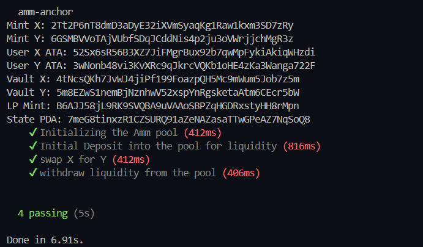

# Decentralized AMM built on Solana using Anchor.

This project implements a decentralized Automated Market Maker (AMM) on the Solana blockchain using the Anchor framework. It provides a platform for users to trade tokens in a trustless and efficient manner.

### Installation
1. Clone the repository:
    ```bash
    git clone https://github.com/0x4nud33p/amm-anchor.git
    cd amm-anchor
    ```
2. Install dependencies:
    ```bash
    yarn install 
    ```
3. Build the program:
    ```bash
    anchor build
    ```
4. Test the program:
    ```bash
    anchor test
    ```

### passing tests 

